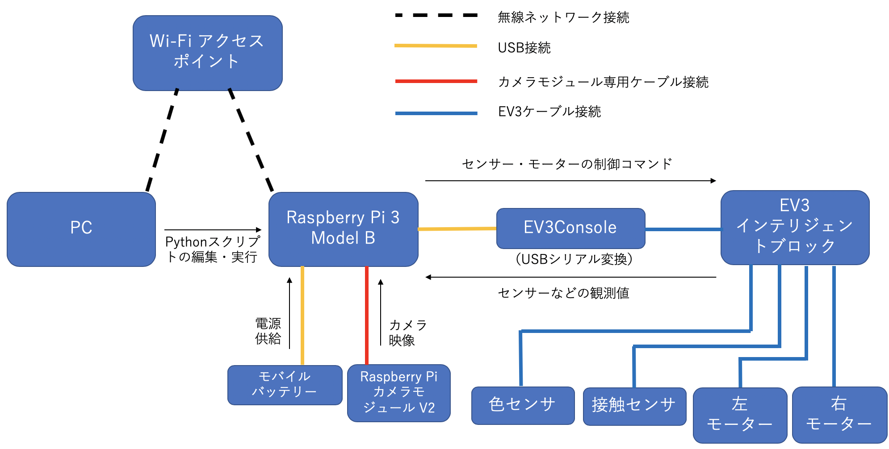

# About
レゴ&reg;マインドストーム&reg; EV3をRaspberry Pi 3 Model Bから制御するためのソフトウェア、
及び、Chainerによる学習ベースのEV3制御のサンプルコードです。

# システムを構成する機材
- 教育版レゴマインドストームEV3 一式 [参考製品](http://afrel-shop.com/shopdetail/000000000380/ct82/page1/recommend/)
- EV3用バッテリー充電用DCアダプター 1個 [参考製品](http://afrel-shop.com/shopdetail/010002000001/ct122/page1/recommend/)
- Raspberry Pi 3 Model B（ケース付きを推奨） 1個 [参考製品](https://www.raspberrypi.org/products/raspberry-pi-3-model-b/)
- USBケーブル (A - micro B、データ転送対応) 1個 [参考製品](https://www.elecom.co.jp/products/MPA-AMBR2U07BK.html) 
- 32GB マイクロSDカード 2枚 [参考製品](https://www.silicon-power.com/web/jp/product-157) 
- Raspberry Pi カメラモジュール V2 1個 [参考製品](https://www.raspberrypi.org/products/camera-module-v2/)
- EV3Console 1個 [参考製品](http://www.mindsensors.com/ev3-and-nxt/40-console-adapter-for-ev3)
- モバイルバッテリー 1個 [参考製品](https://www.ankerjapan.com/item/A1263.html)
- モバイルバッテリー充電用USBアダプタ 1個 
- PC（ノート型PCを推奨）
- 無線ネットワークアクセスポイント（PCとラズパイで同一ネットワーク内につなげて利用することを推奨）

# システム構成


# 各ディレクトリの役割
  ```
  chainer-ev3
  ├── course : ライントレース実験で利用するコースデータが含まれています。A0用紙に印刷してライントレースで使用します。
  ├── ev3 : ev3側で動作させるアプリの元のソースコードです。 
  └── workspace : EV3を動作させるためのサンプルコードを実行する場所になります。
  ```

# EV3の環境構築
- [こちらを参照](https://github.pfidev.jp/marumaru/chainer-ev3-public/blob/master/document/ev3_setup.md)

# Raspberry Pi 3の環境構築
- [こちらを参照](https://github.pfidev.jp/marumaru/chainer-ev3-public/blob/master/document/raspi_setup.md)


# サンプルコードの実行方法

## EV3ポート
ここで提供されるサンプルプログラムは以下のポートにモーター・センサーが接続されていることを前提とします。

- 接触センサ: `Port 2` 
- 色センサー: `Port 3` 
- Lモーター（左）: `Port B` 
- Lモーター（右）: `Port C`  

ソースコードを書き換えることで任意のポートに変更することができます。

## 実行前の準備
  以下の手順で準備をします。
  1. クライアントPCのウェブブラウザでラズパイ上のJupyterLabを表示してください。
  2. EV3のスイッチを押します。（SDカードがEV3に差し込まれていることを確認してください）
  3. EV3が起動したらSDカードから`chainer-ev3`アプリを起動します。
  4. JupyterLabで任意のサンプルコードを実行してください。


## 基本制御
EV3と接続したRaspberry Pi3で動作させることを想定しています。

### 基本制御プログラム
- タッチセンサーの状態を表示する。
  ```
  basic_get_touch_sensor_state.ipynb
  ```

- カラーセンサーから観測される反射値を表示する。
  ```
  basic_get_color_sensor_intensity.ipynb
  ```

- まっすぐ走って３秒後に自動的に止まる。タッチセンサーを押すことでスタート。
  ```
  basic_go_straight.ipynb
  ```

- 円を描きながら走る。タッチセンサーを押してスタート、もう一度押してストップ
  ```
  basic_go_around.ipynb
  ```
  
- EV3のLCDに文字列を表示する。
  ```
  basic_display_strings_on_lcd.ipynb
  ```
  
- EV3の5つのボタン（ENTER, UP, DOWN, LEFT, RIGHT）が押された状態を出力する。
  ```
  basic_button_click.ipynb
  ```

## カメラ制御
ラズパイに接続したカメラを使ったサンプルプログラムです。

### カメラの画像の表示
`camera_show_image.ipynb`はカメラの映像を1秒ごとに出力に表示するプログラムです。

### カメラの画像データのロギング
`camera_labeled_image_logger.ipynb`はEV3のボタンを押す度にカメラの画像とボタンに対応したラベルを保存するプログラムです。
タッチセンサーを押すことで終了します。保存したデータは`camera_test/[年月日-時分秒]`以下に作られます。

各ボタンに対応したラベルは以下のようになります。
  - ENTERボタン: 0
  - UPボタン   : 1
  - LEFTボタン : 2
  - DOWNボタン : 3
  - RIGHTボタン: 4

データは以下のような構成で保存されます。
  ```
  $ tree camera_test/20190307-140802	
  camera_test/20190511-160802
  ├── images
  │   ├── 0000000.png
  │   ├── 0000001.png
  │   ├── 0000002.png
  │   ...
  │   └── 0000160.png
  └── list.txt
  ```

`list.txt` は以下のように画像名と（各撮影ボタンに対応した）角度の組が記録されています。
  ```
  $ head list.txt -n 5
  0000000.png 0
  0000001.png 1
  0000002.png 2
  0000003.png 3
  0000004.png 4
  ```

## 関数回帰
簡単な二次関数`x^2+3x+1`の回帰をニューラルネットワークで行うサンプルプログラムです。

### モデルの訓練
`regression_quadratic_func_trainer.ipynb`を実行してください。
訓練したモデルは`regression_model/mlp.model`として保存されます。

### モデルの評価
`regression_quadratic_func_evaluator.ipynb`を実行してください。
`regression_model/mlp.model`が読み込まれ、入力に対する予測値と誤差を出力します。


## ライントレース

### ルールベースのライントレース
`rule_linetracer.py`はカラーセンサーの反射値とP制御によってライントレースを行うコードです。
 1. JupyterLabで以下のnotebookを実行します。

  ```
  rule_linetrace_controller.ipynb
  ```

 2. カラーセンサーで白い地面の色値を取得します（キャリブレーション1）。カラーセンサーを白い地面の上に来るように設置し、タッチセンサーのボタンを押します。
 
 3. ev3で黒い地面の色値を取得します（キャリブレーション2）。カラーセンサーを黒い地面の上に来るように設置し、タッチセンサーのボタンを押します。
 
 4. ev3がコースに沿って移動し始めます。初期位置が悪いとラインを見つけられないので、ラインの黒と白の間にカラーセンサーが来るように設置してください。
 
 5. ev3のタッチセンサーを押すとラズパイ側のプログラムが終了します。

注）環境によってP制御で必要なパラメータは変化します。実行する環境によって適切なパラメータを設定してください。


### データのロギング
`ml_linetrace_logger.ipynb`は教師データ作成のために、ルールベースのライントレースを動かしながらカメラ画像と制御値（steer値）の組を保存するプログラムです。

実行方法は`rule_linetrace_controller.ipynb`と同じです。タッチセンサーを押すことでプログラムが終了します。

実行することでログデータのディレクトリ（`ml_linetrace_data/年月日-時分秒`）が作成されます。
以下はログデータのディレクトリ構成の例です。`list.txt`と`images`以下に各タイムステップの画像が保存されています。
  ```
  $ tree ml_linetrace_data/20190307-140802	
  ml_linetrace_data/20190307-140802
  ├── images
  │   ├── 0000000.png
  │   ├── 0000001.png
  │   ├── 0000002.png
  │   ...
  │   └── 0005157.png
  └── list.txt
  ```
 
`list.txt` は以下のように画像名と制御値（steer値）の組の行が記録されています。
  ```
  $ head list.txt -n 5
  0000000.png -26
  0000001.png -26
  0000002.png -26
  0000003.png -26
  0000004.png -26
  ```
`list.txt`のフォーマットはChainerの[`LabeledImageDataset`](https://docs.chainer.org/en/latest/reference/generated/chainer.datasets.LabeledImageDataset.html#chainer.datasets.LabeledImageDataset)関数で直接ロードすることのできる形式です。

次の学習ベースのライントレースモデルを作るために約3000組の教師データを目安としています。


### ライントレースモデルの訓練
  ラズパイでは学習に時間がかかるため、PCでの実行を推奨します。
  `ml_linetrace_trainer.ipynb`は、`ml_linetrace_logger.ipynb`で作成したデータをもとに、ライントレースの制御モデルを訓練するプログラムです。
  実行するためには、コード中の`input_dir`を作成したデータセットのディレクトリ名（例：`input_dir = 'ml_linetrace_data/20190520-114406'`）に変更してください。
  `out_dir`で指定したディレクトリ以下に次のような訓練済みモデルが作成されます。
  ```
  $ tree ml_linetrace_model
  ml_linetrace_model
  ├── mlp.state
  └── mlp.model
  ```

### 学習ベースのライントレース
- `ml_linetrace_controller.ipynb`はカメラ画像を入力としたChainerの訓練済みモデル（３層MLP）でライントレース制御を行うコードです。

- 実行するには作成したモデルを読み込むために、モデル`mlp.model`のパスを以下で指定してください。
  ```
  # Load the model
  serializers.load_npz('ml_linetrace_model/mlp.model', model)
  ```

- コードを実行し、タッチセンサーを押すことでEV3が動き始めます。タッチセンサーを再び押すことでEV3が停止し、プログラムも終了します。

## 角度推定
角度推定タスクは、カメラに写ったライントレース用の直線が、カメラに対して何度傾いているか推定するタスクです。
ここでは、-30度、-15度、0度、15度、30度の5種類の角度のデータを集め、角度推定モデルを作成し、角度を推定するプログラムを紹介します。
教師データにないような角度（例：5度）の映像が写っても、それに近い答えを出すことができるモデルを作ります。

### データのロギング
`angle_prediction_logger.ipynb`は角度推定の教師データ作成のために各角度の画像を取得するコードです。
`camera_labeled_image_logger.ipynb`をベースとしています。
ここでは、-30度、-15度、0度、15度、30度の5種類の角度のデータを集めます。
直線ラインに対して、EV3のカメラを撮影したい角度に設置します。
プログラムではEV3のボタンを押すことで、画像の撮影と角度のラベル付けを行います。
- ENTERボタン: 0度 
- UPボタン   : 15度
- LEFTボタン : 30度
- DOWNボタン : -15度
- RIGHTボタン: -30度

撮影したい角度のボタンを押したままの状態で、角度を保ったままカメラの映る範囲で左右に平行移動しながら画像を撮影します。
EV3のLCDに各角度で撮影した枚数が表示されます。各角度ごとに30枚程度（合計150枚）が目安です。
タッチボタンを押すことでプログラムを終了させることができます。

作成したログデータはディレクトリ（`angle_data/[年月日-時分秒]`）に保存されます。
以下はログデータのディレクトリ構成の例です。`list.txt`と`images`以下に各タイムステップの画像が保存されています。
  ```
  $ tree angle_data/20190307-140802	
  angle_data/20190511-160802
  ├── images
  │   ├── 0000000.png
  │   ├── 0000001.png
  │   ├── 0000002.png
  │   ...
  │   └── 0000160.png
  └── list.txt
  ```

`list.txt` は以下のように画像名と（各撮影ボタンに対応した）角度の組が記録されています。
  ```
  $ head list.txt -n 5
  0000000.png 0
  0000001.png 0
  0000002.png 0
  0000003.png 0
  0000004.png 0
  ```

### モデルの訓練
  ラズパイでのモデル訓練は時間がかかるため、PCでの実行を推奨します。
  `angle_prediction_trainer.ipynb`は、`angle_prediction_logger.ipynb`で作成したデータをもとに、ライントレースの制御モデルを訓練するプログラムです。
  実行するためには、コード中の`input_dir`を作成したデータセットのディレクトリ名（例：`input_dir = 'angle_data/20190520-114406'`）に変更してください。

### 角度推定
`angle_prediction_predictor.py`で角度推定を行います。
カメラでラインを撮影すると推定した角度がEV3のLCDに表示されます。


# ライセンス
このソースコードのライセンスはBSD 3-Clauseです。詳しくは[LICENSE](LICENSE.md)を参照してください。
