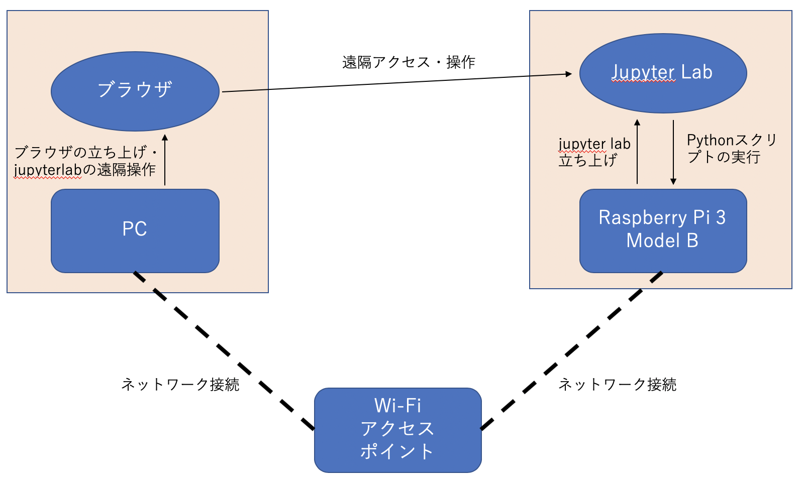

# ※現在はアフレル様よりRaspbianを用いた環境構築方法が提供されています。そちらの方がセットアップ時の外部接続機器（ディスプレイなど）が少なく、提供されるスクリプトによって環境構築が自動化されています。


# Raspberry Pi 3の環境構築（Ubuntu Mate編）
- 準備するもの
  - Raspberry Pi 3 Model B 1個
  - micro SDカード (32GB） 1枚
  - micro SDカードリーダー 1個(PCに備え付けの場合は不要）
  - PC （sshコマンドを実行できるPC環境） 1台
  - 無線ネットワーク環境 （ここではPCとラズパイが同じネットワークセグメントに存在すると仮定します）
  - 外部ディスプレイ 1個
  - HDMIケーブル 1本
  - USB接続マウス 1個
  - USB接続キーボード　1個

- SDカードにUbuntu Mateのイメージをダウンロードしてください。

  [こちら](https://ubuntu-mate.org/download/)からRaspberry Pi用のイメージ(v18.04.2)をダウンロードしてください。

- SDカードにダウンロードしたイメージを書き込んでください。


- ラズパイの起動・更新

  イメージをコピーしたSDカードをラズパイに差し込み、USB接続でマウスとキーボード、HDMI接続でディスプレイを接続する。給電ポートに電源を差し込み起動させます。


- ネットワークに接続し、アップデートをかけます。

  ```
  $ sudo apt update; sudo apt upgrade;
  ```

- Wicdをインストール

  デフォルトのネットワークマネージャーでは本体にログインしている状態でなければssh接続が途切れてしまいます。
  そのためWicdをインストールしてネットワークを管理します。
  ```
  $ sudo apt install -y wicd wicd-curses wicd-gtk
  $ sudo apt remove --purge network-manager
  ```

- デーモンを起動

  ```
  $ sudo service wicd start
  ```
  wicd-gtkを起動し、ネットワークを設定します。
  （固定ipアドレスを設定を推奨します。）


- wicd-gtk

  以下のコマンドより、起動時にwicdデーモンの起動を有効にします。
  ```
  $ sudo systemctl enable wicd
  ```

- SSHの設定

  ```
  $ sudo apt install -y openssh-server
  $ sudo systemctl enable ssh
  $ sudo dpkg-reconfigure openssh-server
  ```
  ラズパイの再起動をしてPCからssh接続ができるかを確認します。

- ラズパイカメラの設定

  ```
  $ sudo apt-get install raspi-config
  $ sudo raspi-config
  ```
  config画面が立ち上がったら、「Interface Options」→ 「P1 Camera」を選択し、カメラを有効化します。再起動したら以下のコマンドを実行してカメラの動作を確認します。
  ```
  $ raspivid -o test.h264 -t 10000
  ```

- パッケージツールのインストール

  ```
  $ sudo apt install -y git gcc g++ make libssl-dev libbz2-dev libreadline-dev libsqlite3-dev zlib1g-dev libjpeg-dev
  ```

- pyenvのセットアップ

  ```
  $ git clone https://github.com/yyuu/pyenv.git ~/.pyenv
  $ echo 'export PYENV_ROOT="$HOME/.pyenv"' >> ~/.profile
  $ echo 'export PATH="$PYENV_ROOT/bin:$PATH"' >> ~/.profile
  $ echo 'eval "$(pyenv init -)"' >> ~/.profile
  ```

- pyenv-virtualenvのセットアップ

  ```
  $ git clone https://github.com/yyuu/pyenv-virtualenv.git ~/.pyenv/plugins/pyenv-virtualenv
  $ echo 'eval "$(pyenv virtualenv-init -)"' >> ~/.profile
  ```

- Python3のセットアップ

  Python3.6.8をインストール。
  ```
  $ source ~/.profile
  $ pyenv install 3.6.8
  ```

- レポジトリのクローンとpython仮想環境の構築

  ```
  $ cd
  $ git clone git@/pfnet-research/chainer-ev3.git
  $ cd chainer-ev3/workspace
  $ pyenv virtualenv 3.6.8 chainer-ev3
  $ pyenv local chainer-ev3
  $ pip install --upgrade pip
  $ pip install -r requirements_rpi.txt
  ```

- JupyterLabの設定 - クライアントPCのブラウザからラズパイ上のJupyterLabを遠隔操作する -

  ウェブブラウザで動作するIDEのJupyterLabの設定をします。ここでは図のようにクライアントPCのブラウザでラズパイ上で動作させたJupyterLabを表示・操作する手順を示します。
  
  
  
  Python仮想環境を作成の上、ラズパイ上で以下のコマンドを実行します。
  ```
  $ cd /PATH/TO/chainer-ev3/workspace
  $ jupyter lab --generate-config
  ```
  `$HOME/.jupyter/jupyter_notebook_config.py`が生成されていることを確認します。
  `jupyter_notebook_config.py`をエディタで開き、`c.NotebookApp.ip`と`c.NotebookApp.token`のコメントアウトを外し、次のように編集します。この例のようにtokenを設定していませんが、ネットワーク内の第三者に参照させない場合は、必ずtokenの設定をしてください。
  ```
  c.NotebookApp.ip = '0.0.0.0'
  c.NotebookApp.token = ''
  ```
  
  ラズパイ上でJupyterLabを起動します。
  ```
  $ cd ~/chainer-ev3/workspace
  $ jupyter lab
  ```
  
  クライアントPCのブラウザを立ち上げ、アドレスバーに`http://<ラズパイのip address>:8888`と打ち込み、以下のような画面が出たら成功です。
  
  
- ラズパイ上のJupyterLabの自動起動設定
  
  ラズパイの起動のたびにJupyterLabを立ち上げるのは手間がかかるため、自動で起動するように設定します。
  
  サービスの設定ファイルを作成します。管理者権限で、`/etc/systemd/system/jupyter.service`をエディタで開き、以下の内容をコピーして保存してください。`USERNAME`と`USERGROUP`は適切な値に変更してください。
  ```
  [Unit]
  Description = JupyterLab
  [Service]
  Type=simple
  PIDFile=/var/run/jupyter.pid
  ExecStart=/home/USERNAME/.pyenv/versions/chainer-ev3/bin/jupyter lab
  WorkingDirectory=/home/USERNAME/chainer-ev3/workspace
  User=USERNAME
  Group=USERGROUP
  Restart=always
  [Install]
  WantedBy = multi-user.target
  ```
  
  `jupyter.service`がUnit一覧に存在することを確認します。
  ```
  $ sudo systemctl list-unit-files --type=service | grep jupyter
  jupyter.service                           disabled
  ```
  
  以下のコマンドを実行して、サービスが起動できることを確認します。
  ```
  $ sudo systemctl start jupyter
  $ sudo systemctl status jupyter
  ● jupyter.service - JupyterLab
   Loaded: loaded (/etc/systemd/system/jupyter.service; enabled; vendor preset: enabled)
   Active: active (running) since Mon 2019-05-20 16:09:35 JST; 19min ago
  ```

  stopコマンドで停止できることを確認します。
  ```
  $ sudo systemctl stop jupyter
  ● jupyter.service - JupyterLab
   Loaded: loaded (/etc/systemd/system/jupyter.service; enabled; vendor preset: enabled)
   Active: inactive (dead) since Mon 2019-05-20 16:30:08 JST; 14s ago
   ```

   サービスの動作確認ができたので、自動起動の設定をします。
   ```
   $ sudo systemctl start jupyter
   $ sudo systemctl enable jupyter
   Created symlink from /etc/systemd/system/multi-user.target.wants/jupyter.service to /etc/systemd/system/jupyter.service.
   ```

   ラズパイを再起動して、クライアントPCのブラウザからラズパイ上のJupyterLabにアクセスできるか確認してください。

- EV3Consoleのセットアップ

  ev3consoleをラズパイとev3へ接続し、[こちらの記事](http://botbench.com/blog/2013/08/18/tutorial-using-the-mindsensors-ev3console-in-linux/)に従ってセットアップを行います。
  
  次に、USBシリアルポートへのアクセス権限を得るためにdialoutグループに追加します。

  ```
  $ sudo gpasswd -a $USER dialout
  ```
